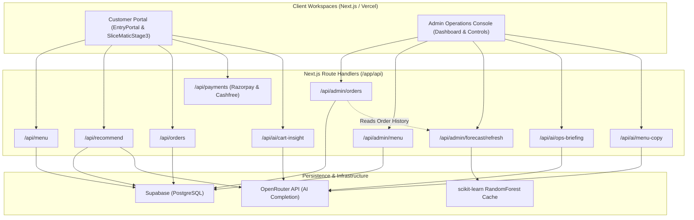

# SliceMatic Stage 3

SliceMatic is a full-stack PizzaFlow delivery application built for the Stage 3 live demo. It includes a customer ordering flow, Supabase-backed menu/orders schema, admin dashboard, CSV export, and an OpenRouter-powered recommendation engine.

## Architecture & System Data Flow



The application separates concerns cleanly: the **Customer Workspace** runs on a state-aware custom storefront while the **Admin Operations Console** isolates configurations, forecasts, and live-metrics to prevent layout clutter and operational overlap.


## Application Workspaces

SliceMatic is structured as a real product with separate workspaces, not one giant form:

- Customer app: intake, optional customer account login/logout/recovery/reset, AI recommendation, menu browsing, pizza builder, cart, checkout, tracking, and final bill.
- Admin console: login, logout, forgot password, reset password, authenticated operations dashboard, filters, revenue metrics, CSV export, order table, forecast, settings, and menu lifecycle tools.
- AI lab: admin-facing AI explanations, recommendation strategy, cart strategist, menu copywriter, and operations briefing.

The customer workspace does not render the admin console below the order flow. The admin workspace does not render the customer cart or ordering stage. This keeps the live demo focused and makes the application feel like a complete delivery platform.

## Stage 3 Rubric Coverage

| Requirement | Implementation |
| --- | --- |
| Frontend on Vercel, Next.js/React recommended | Next.js App Router app in this folder. Vercel-ready with `npm run build`. |
| Full ordering flow | Customer intake, AI recommendation, menu customization, cart, checkout, bill totals, and tracking confirmation. |
| Supabase backend and database | `supabase/schema.sql` creates separate menu, orders, and line-item tables. API routes use Supabase JS. |
| Menu from DB tables | `/api/menu` reads `slicematic.pizza_types`, `pizza_bases`, `toppings`, and `pizza_sizes`; demo seed fallback is only for local no-key runs. |
| Orders saved in PostgreSQL | `/api/orders` inserts customer, order, order item, item topping, totals, payment method, address, and recommendation status. |
| Admin login | Admin screen signs in with Supabase Auth when Supabase env keys exist; local demo credentials are available for development. |
| Admin dashboard | Revenue, order count, AOV, top-selling pizza, busiest hour, payment mix, order filters, CSV export, menu controls, and forecast panel. |
| Preserve Stage 2 logic | Name, phone, quantity, payment, discount, GST, and bill calculation rules live in `lib/pricing.ts`. |
| AI/ML integration | OpenRouter recommendation engine, AI cart strategist, AI menu copywriter, AI operations briefing, recommendation logging, and demand forecast dashboard. |

## Stage 2 Business Rules Preserved

- Name: alphabets and spaces only, 2-40 characters.
- Phone: exactly 10 digits and starts with 6, 7, 8, or 9.
- Delivery radius: active launch radius is 0-4 km; 4-6 km is rejected with a controlled message.
- Total quantity: 1-10 pizzas per order.
- Discount: 10% when total pizza quantity is 5 or more.
- GST: 18% after discount.
- Payment modes: Cash, Card, UPI only.
- Bill: itemized line total, subtotal, discount, GST, final payable amount. (All currency values are strictly rounded to integers to eliminate decimals across the frontend UI and backend).

The source of truth is `lib/pricing.ts`.

## Test Driven Development (TDD)
The core logic for pricing, data parsing, and payment gateways is verified using Vitest. 
- 100% logic and edge-case parity with the original MVP Python tests.
- 44 tests across 6 suites (including Razorpay, Cashfree, Zustand Store, Pricing, and Data Services).
- Follows the Red-Green-Refactor protocol to prevent regressions in billing math and API behavior.
- Test suites run cleanly in Node environments with mocked APIs and middleware.

## Menu Lifecycle

Admin users can add new sellable catalogue items from the Menu tab:

- New pizza type: code, name, price, badge, prep time, tags, uploaded image/URL, live preview, and description.
- New crust/base: code, name, price, description.
- New topping: code, name, price.

When Supabase is configured and the admin is signed in, `POST /api/admin/menu` creates a real database row in the correct menu table. During local demo mode, the item is added to the in-memory menu so the workflow can still be shown without credentials.

New available pizzas appear in the customer menu immediately. New bases and toppings appear inside the pizza builder immediately.

Pizza images are uploaded through the admin menu studio. The upload route validates JPG, PNG, WEBP, and GIF files up to 4 MB, saves them under `public/uploads/menu`, returns a dynamic URL, and the menu preview auto-fits the image before the item is saved.

## Admin Authentication

The admin console is built like a secure application workspace:

- Login screen with validated email and password.
- Logout action from the signed-in admin shell.
- Forgot password screen using Supabase `resetPasswordForEmail` when env keys are configured.
- Reset password screen using Supabase `updateUser` during a recovery session.
- Local demo fallback that can reset the demo password for the current browser session.
- Admin APIs remain protected with bearer-token checks when Supabase admin env keys exist.

## Customer Authentication & Entry Portal

Customer accounts are supported via two routes depending on flow:
- **New OTP Entry Portal**: Users start in a unified glassmorphic `EntryPortal` (`components/EntryPortal/EntryPortal.tsx`) requiring email/OTP sign-in, with a automatic demo fallback for local/no-key development.
- **Continue-as-guest**: Guests can enter the workspace immediately. If they want to unlock cash payment, clicking "Sign in for Cash" in the Cart redirects them back to the new OTP-based `EntryPortal`.
- **Saved session restoration**: The app retains user sessions (emails/profile names) in sessionStorage and automatically pulls past order history and recommendations.
- **Account Workspace**: Logged-in customers gain access to their account workspace (`workspace === "account"`) to manage their order history, personal AI recommendations, and password recovery.

Demo customer credentials:
```text
Email: customer@slicematic.in
Password: slice-customer
```

## Payments (Razorpay & Cashfree Sandbox)

SliceMatic supports both Razorpay and Cashfree SDK integrations for online payments:

### Razorpay Integration
- Card and UPI payments use Razorpay's `checkout.js` modal in test mode.
- Cash orders follow the direct path.
- The server creates a Razorpay order (`POST /api/payments/create-order`) after recomputing the bill server-side.
- Signature validation is checked via HMAC-SHA256 (`POST /api/payments/verify`).

### Cashfree Integration
- Uses Cashfree JS SDK (`@cashfreepayments/cashfree-js`).
- Creates order on Cashfree (`POST /api/payments/cashfree/create-order`) and redirects user to verify payment state (`POST /api/payments/cashfree/verify`).
- Restricted to sandbox mode by default unless `CASHFREE_ENV` is set to `production`.

**Server-only keys:** `RAZORPAY_KEY_SECRET` and `CASHFREE_SECRET_KEY` never leave the server.

**Guest vs member:**
- Guest checkout: UPI or Card only (no Cash) unless explicitly permitted by the owner settings.
- Logged-in member: Cash, Card, or UPI.


## Admin Operations Console & Owner Controls

The Admin Console (`app/admin-dashboard/page.tsx`) provides a premium workspace designed for store owners to manage operations, review performance metrics, and dynamically alter business rules:

### 1. Operations Dashboard & Live Metrics
- **Outlet Pulse Strip**: Provides at-a-glance information on outlet readiness, peak load statuses, card/UPI online payment mix, and AI briefing alerts.
- **Aggregated Financials**: Computes Total Revenue, Order Count, Average Order Value (AOV), and busiest sales hour in real-time from active database records.
- **Interactive Action Board**: Converts passive data points into actionable tasks:
  - **Protect Peak**: Suggests staffing changes based on busiest times.
  - **Push Winner**: Identifies the highest-volume pizza to adjust marketing focus.
  - **Payment Risk**: Monitors the share of Cash vs. Online payments.
  - **Margin Lever**: Uses current AOV to optimize upselling strategies in the AI Cart Strategist.

### 2. Order Filters & Management
- Admins can query orders dynamically by payment mode (Cash, Card, UPI) and filter by specific order dates.
- Status management controls allow changing order states (Pending, In Transit, Delivered, Cancelled) with immediate persistence in Supabase.

### 3. Dynamic Business Rule Configurator (Settings Tab)
Store policies can be modified in real-time, instantly propagating changes to the storefront and backend API validations:
- **Brand Identity**: Customize outlet name, open/closed status, and promotional copywriting.
- **Financial Controls**: Set specific GST percentages and maximum order capacities.
- **Loyalty/Discounts**: Customize bulk discount percentages and minimum quantity requirements.
- **Logistics**: Change delivery fees, free delivery order thresholds, and maximum delivery radius limits (in kilometers).
- **Security & Risk**: Toggle `guestCashAllowed` to dictate whether guest accounts can place Cash-on-Delivery orders or require online payment methods.

### 4. CSV Reports & Auditing
- Includes a dedicated endpoint (`GET /api/admin/orders?format=csv`) to compile and download all order records as standardized CSV logs for offline auditing.


## Local Setup

```bash
cd FullStack
npm install
cp .env.example .env.local
npm run dev
```

Open `http://localhost:3000`.

Without environment keys the app runs with demo menu/orders so the UI can be reviewed immediately. With Supabase keys it becomes fully persistent.

## Environment Variables

```bash
NEXT_PUBLIC_SUPABASE_URL=
NEXT_PUBLIC_SUPABASE_ANON_KEY=
SUPABASE_SERVICE_ROLE_KEY=
OPENROUTER_API_KEY=
OPENROUTER_MODEL=openai/gpt-oss-20b
NEXT_PUBLIC_DEMO_ADMIN_EMAIL=admin@slicematic.in
NEXT_PUBLIC_DEMO_ADMIN_PASSWORD=slicematic-demo
RAZORPAY_KEY_ID=rzp_test_...
RAZORPAY_KEY_SECRET=...
```

Keep `SUPABASE_SERVICE_ROLE_KEY` and `RAZORPAY_KEY_SECRET` only in server environments such as Vercel project settings. Never expose them in browser code.

## Supabase Setup

1. Create a Supabase project.
2. Open SQL Editor.
3. Run `supabase/schema.sql`.
4. In Authentication, create the admin user used for the demo.
5. Add the environment variables to `.env.local` and to Vercel.
6. For marking, create a read-only Supabase user or invite the evaluator with read-only access.

The required core tables are:

- `slicematic.pizza_types`
- `slicematic.pizza_bases`
- `slicematic.toppings`
- `slicematic.pizza_sizes`
- `slicematic.customer`
- `slicematic.orders`
- `slicematic.order_item`
- `slicematic.order_item_topping`
- `slicematic.recommendation_event`

## AI Features & LLM Integration

SliceMatic integrates advanced language model (LLM) agents using the **OpenRouter TypeScript SDK** and raw HTTP route handlers. These features bridge customer storefront customization with back-of-house operations management:

### 1. Customer AI Recommendation Engine
* **Trigger Point**: Triggers automatically after the customer submits their name and phone number on the intake step.
* **Mechanism**:
  - The route handler `/api/recommend` fetches past orders for the customer's phone number from Supabase.
  - It compiles a structured profile: total orders, total spend, vegetarian ratio, average quantity, spicy preferences, and top items.
  - It passes this profile along with the *currently available* menu item IDs to the LLM.
  - **Output**: JSON payload specifying `pizzaId`, `toppingId`, `confidence`, and a short `reason`.
  - **Guardrail**: If the model suggests a non-existent or currently deactivated pizza/topping ID, the server intercepts the response and applies a popularity fallback before sending it to the UI.
  - **Closed-Loop Attribution**: Every recommendation is logged to `slicematic.recommendation_event`. If the user adds the recommended pair to the cart and checks out, `/api/orders` links the purchase back to the recommendation event, marking the status as `Purchased` for conversion tracking.

### 2. Customer AI Cart Strategist
* **Trigger Point**: Cart drawer/panel preview.
* **Mechanism**:
  - Evaluates the current cart contents, total cart value, and owner-configured bulk discount thresholds (e.g., "10% off for 5+ pizzas").
  - **Output**: A micro-copy banner displaying custom upsell recommendations, combo ideas, or proximity notifications to help the user hit discount thresholds or free delivery margins.
  - **Business Impact**: Improves Average Order Value (AOV) by providing contextual value (e.g., "Add 1 more pizza to get 10% off your total order!") instead of generic spam.

### 3. Admin AI Menu Copywriter
* **Trigger Point**: Menu creation panel in the admin studio.
* **Mechanism**:
  - When an admin inputs a raw draft name, base price, and category tags, the copywriter drafts premium marketing assets.
  - **Output**: A structured description, promotional tags (e.g. "Signature", "Spicy"), an urgency badge (e.g. "Chef's Special", "New"), and preparation times.

### 4. Admin AI Operations Briefing
* **Trigger Point**: Admin Dashboard landing view.
* **Mechanism**:
  - Reads total revenue, average order value, payment mix, peak sales hour, and the demand forecast matrix.
  - **Output**: A daily briefing including staff management recommendations, kitchen prep prioritization lists, and prioritized revenue-driving tasks.

---

## AI Model Selection & Rationale

### Model Choice: `openai/gpt-oss-20b` (via OpenRouter)
The recommendation engine is configured to use the **`openai/gpt-oss-20b`** model by default (configurable via the `OPENROUTER_MODEL` environment variable).

### Why this Model is Used for Customer Recommendations:
1. **Flavour Profiling & Semantic Pairing**:
   - The model acts as a virtual pizza sommelier. Rather than just doing a basic database join, it performs **semantic reasoning** on the customer's order history.
   - For example, if a customer's history shows a strong pattern of vegetarian orders, the model understands the semantic relationship and avoids recommending non-veg toppings like pepperoni or chicken.
   - If the history indicates a preference for spicy profiles, it connects this to toppings like jalapenos or peri-peri drizzle, creating high-context recommendations (e.g., "We paired your favourite Farm House pizza with a spicy Peri-Peri drizzle since you love bold flavours.").
2. **Strict JSON Schema Adherence**:
   - Our storefront parses the recommendation payload dynamically in Javascript. A malformed response or conversational fluff would break the layout or crash the storefront.
   - Using the `response_format: { type: "json_object" }` flag, the `gpt-oss-20b` model strictly outputs key-value pairs (`pizzaId`, `toppingId`, `reason`, `confidence`) without conversational introductions or markdown wraps.
3. **Optimized Latency (Speed)**:
   - Recommendations are rendered immediately after customer intake. If the API request takes 5+ seconds, the customer will navigate away, resulting in lost conversions.
   - The 20B parameters model operates with sub-second API execution, returning highly personalized suggestions almost instantly.
4. **Cost-Efficiency & Scale**:
   - Running full-scale personalization calls for every guest or returning user using large models (like GPT-4) would generate significant token usage fees. The 20B model provides the necessary reasoning capabilities at a fraction of the cost, making it ideal for high-throughput, student-scale production runs.
5. **Resilience & Graceful Failures**:
   - If the OpenRouter service becomes unavailable or rate-limited, the handler catches the exception and falls back to a deterministic recommendation service (`lib/pricing.ts` rules) that recommends the overall best-selling items, ensuring a smooth customer experience.


## Demand Forecast ML

The admin **Forecast** tab reads a scikit-learn cache trained on Supabase order history. Training runs offline; the dashboard serves the cached predictions on Vercel without needing Python at request time.

### Model choice

**RandomForestRegressor** (not LinearRegression) because order volume has non-linear lunch/dinner peaks and weekend bumps that a single linear plane underfits.

### Features and target

| Feature | Description |
|---|---|
| `weekday` | Day of week (0=Mon … 6=Sun, IST) |
| `hour` | Hour of day (0–23, IST) |
| `is_weekend` | 1 if Saturday/Sunday else 0 |
| `hourly_revenue` | Total revenue in that hour bucket |

**Target:** orders per hour.

### Evaluation metric

Hold-out **RMSE** (root mean squared error) in orders/hour on 22% of hourly buckets when at least 20 buckets exist. Shown in the dashboard model card and CLI output.

### Refresh workflow

```bash
python -m pip install -r requirements-ml.txt
npm run forecast:refresh
```

`forecast:refresh` pulls `order_datetime` + `final_amount` from Supabase, trains via `scripts/forecast_model.py`, and writes `lib/generated/forecast-cache.json`. Re-run after meaningful order activity before deploy so Vercel serves fresh peaks.

Local-only retrain from the admin session: `POST /api/admin/forecast/refresh` (requires Python + scikit-learn on the machine).

Q&A demo (synthetic data, prints RMSE + top windows):

```bash
python scripts/forecast_model.py
```

## Deployment

```bash
npm run build
```

Deploy the `FullStack` directory to Vercel and set all environment variables in Vercel Project Settings.

Submission checklist:

- Public Vercel URL.
- GitHub repository URL.
- Supabase read-only access for evaluator.
- Loom walkthrough link.
- README with architecture, setup, AI feature, system prompt, and model rationale.
- Live demo ready to show one code modification, such as changing the discount trigger in `lib/pricing.ts` from 5 pizzas to 3.

## Demo Flow

1. Enter a valid name, phone, and delivery address.
2. Show AI recommendation and explain OpenRouter plus Supabase history lookup.
3. Build a pizza with base, size, toppings, and quantity.
4. Place order with UPI, Card, or Cash.
5. Open admin dashboard, show filters, CSV export, top pizza, busiest hour, and revenue summary.
6. Explain schema tables and how `orders` and `order_item` separate header vs line data.
