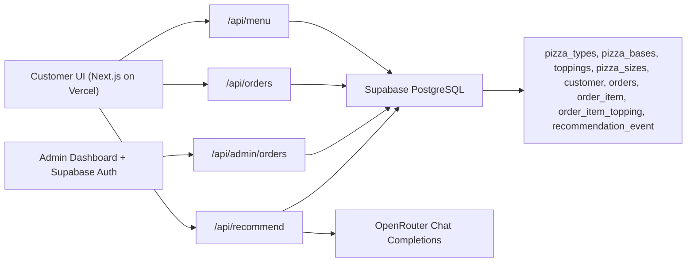

# SliceMatic Stage 3

SliceMatic is a full-stack PizzaFlow delivery application built for the Stage 3 live demo. It includes a customer ordering flow, Supabase-backed menu/orders schema, admin dashboard, CSV export, and an OpenRouter-powered recommendation engine.

## Architecture



## Stage 3 Rubric Coverage

| Requirement | Implementation |
| --- | --- |
| Frontend on Vercel, Next.js/React recommended | Next.js App Router app in this folder. Vercel-ready with `npm run build`. |
| Full ordering flow | Customer intake, AI recommendation, menu customization, cart, checkout, bill totals, and tracking confirmation. |
| Supabase backend and database | `supabase/schema.sql` creates separate menu, orders, and line-item tables. API routes use Supabase JS. |
| Menu from DB tables | `/api/menu` reads `slicematic.pizza_types`, `pizza_bases`, `toppings`, and `pizza_sizes`; demo seed fallback is only for local no-key runs. |
| Orders saved in PostgreSQL | `/api/orders` inserts customer, order, order item, item topping, totals, payment method, address, and recommendation status. |
| Admin login | Admin screen signs in with Supabase Auth when Supabase env keys exist; local demo credentials are available for development. |
| Admin dashboard | Revenue, order count, AOV, top-selling pizza, busiest hour, payment mix, order filters, CSV export, menu controls, and forecast panel. |
| Preserve Stage 2 logic | Name, phone, quantity, payment, discount, GST, and bill calculation rules live in `lib/pricing.ts`. |
| AI/ML integration | OpenRouter recommendation engine after name/phone; history-aware Supabase lookup; recommendation logging; demand forecast dashboard. |

## Stage 2 Business Rules Preserved

- Name: alphabets and spaces only, 2-40 characters.
- Phone: exactly 10 digits and starts with 6, 7, 8, or 9.
- Delivery radius: active launch radius is 0-4 km; 4-6 km is rejected with a controlled message.
- Total quantity: 1-10 pizzas per order.
- Discount: 10% when total pizza quantity is 5 or more.
- GST: 18% after discount.
- Payment modes: Cash, Card, UPI only.
- Bill: itemized line total, subtotal, discount, GST, final payable amount.

The source of truth is `lib/pricing.ts`.

## Local Setup

```bash
cd FullStack
npm install
cp .env.example .env.local
npm run dev
```

Open `http://localhost:3000`.

Without environment keys the app runs with demo menu/orders so the UI can be reviewed immediately. With Supabase keys it becomes fully persistent.

## Environment Variables

```bash
NEXT_PUBLIC_SUPABASE_URL=
NEXT_PUBLIC_SUPABASE_ANON_KEY=
SUPABASE_SERVICE_ROLE_KEY=
OPENROUTER_API_KEY=
OPENROUTER_MODEL=openai/gpt-oss-20b
NEXT_PUBLIC_DEMO_ADMIN_EMAIL=admin@slicematic.in
NEXT_PUBLIC_DEMO_ADMIN_PASSWORD=slicematic-demo
```

Keep `SUPABASE_SERVICE_ROLE_KEY` only in server environments such as Vercel project settings. Never expose it in browser code.

## Supabase Setup

1. Create a Supabase project.
2. Open SQL Editor.
3. Run `supabase/schema.sql`.
4. In Authentication, create the admin user used for the demo.
5. Add the environment variables to `.env.local` and to Vercel.
6. For marking, create a read-only Supabase user or invite the evaluator with read-only access.

The required core tables are:

- `slicematic.pizza_types`
- `slicematic.pizza_bases`
- `slicematic.toppings`
- `slicematic.pizza_sizes`
- `slicematic.customer`
- `slicematic.orders`
- `slicematic.order_item`
- `slicematic.order_item_topping`
- `slicematic.recommendation_event`

## AI Feature

The AI feature is Option A plus an operations layer:

- Trigger point: after name and phone, before menu browsing.
- Data used: customer phone, past Supabase order history, current menu IDs, toppings, and popularity fallback.
- Feature profile: favourite pizza, favourite topping, order count, average quantity, average spend, vegetarian lean, spicy lean, and recency.
- Menu signals: available menu IDs, local favourites, and high-value topping signals so recommendations improve fit and AOV.
- Output: one pizza ID, one topping ID, reason, and confidence.
- Guardrail: the server validates that returned IDs exist in the current available menu.
- Persistence: every shown recommendation is written to `recommendation_event`; if purchased, `/api/orders` marks it as `Purchased`.
- Fallback: if OpenRouter is unavailable, the app still returns a deterministic safe recommendation.

### OpenRouter System Prompt

```text
You are SliceMatic's in-app pizza recommendation assistant for a single outlet in Delhi.
Recommend exactly one pizza and one topping the customer is likely to enjoy.
Hard rules:
- Only choose from the menu IDs provided. Never invent menu items.
- Return strict JSON only.
- If history exists, personalize using favourite pizza, topping, spend, veg/non-veg lean, spicy lean, quantity pattern, and recency.
- If the customer is new, recommend a popular crowd-pleaser and say it is a safe first pick.
- Prefer combinations that improve customer fit and contribution margin without pushing unnecessary discounts.
- Keep the reason under 20 words, friendly, and without emojis.
```

### Model Choice

Default model: `openai/gpt-oss-20b` via OpenRouter.

Reason: the task needs low-latency structured JSON, light personalization, and reliable instruction following. The model is strong enough for grounded menu recommendations while staying cost-conscious for a student demo. The model can be changed by editing `OPENROUTER_MODEL`.

## Demand Forecast ML

The admin forecast panel estimates upcoming peak demand from historical hourly orders. For the live app, the API computes a lightweight forecast from Supabase order history with a demo fallback. The included `scripts/forecast_model.py` can be used to present a scikit-learn training workflow during Q&A.

```bash
python -m pip install -r requirements-ml.txt
python scripts/forecast_model.py
```

## Deployment

```bash
npm run build
```

Deploy the `FullStack` directory to Vercel and set all environment variables in Vercel Project Settings.

Submission checklist:

- Public Vercel URL.
- GitHub repository URL.
- Supabase read-only access for evaluator.
- Loom walkthrough link.
- README with architecture, setup, AI feature, system prompt, and model rationale.
- Live demo ready to show one code modification, such as changing the discount trigger in `lib/pricing.ts` from 5 pizzas to 3.

## Demo Flow

1. Enter a valid name, phone, and delivery address.
2. Show AI recommendation and explain OpenRouter plus Supabase history lookup.
3. Build a pizza with base, size, toppings, and quantity.
4. Place order with UPI, Card, or Cash.
5. Open admin dashboard, show filters, CSV export, top pizza, busiest hour, and revenue summary.
6. Explain schema tables and how `orders` and `order_item` separate header vs line data.
