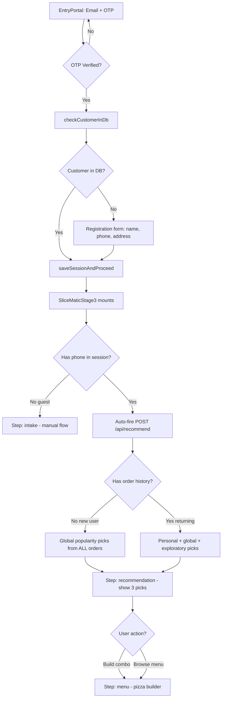

# Plan: Trigger AI Recommendation After Login — Updated with User Feedback

## Two User Flows

### Flow A: New User (no order history)

```
EntryPortal: Email + OTP
  → OTP verified
  → checkCustomerInDb() → customer NOT found
  → Registration form (name, phone, address, city)
  → saveSessionAndProceed()
  → SliceMaticStage3 mounts
  → Session restore: has phone, no order history
  → Auto-fire POST /api/recommend
  → getCustomerHistory() returns [] (new customer)
  → getGlobalPopularity() returns top pizzas/toppings from ALL orders in DB
  → OpenRouter receives: tier="new", empty profile, global popularity data
  → Shows 3 picks based on what's popular across ALL customers
  → User picks one → menu → checkout
```

**Key:** New users see recommendations driven by global popularity — "our most popular combos based on real orders from all customers."

### Flow B: Returning User (has order history)

```
EntryPortal: Email + OTP
  → OTP verified
  → checkCustomerInDb() → customer FOUND in DB
  → saveSessionAndProceed() (no registration form needed)
  → SliceMaticStage3 mounts
  → Session restore: has phone, has order history
  → Auto-fire POST /api/recommend
  → getCustomerHistory() returns their past orders
  → getGlobalPopularity() returns current global trends
  → OpenRouter receives: tier="returning", personal profile + global popularity
  → Shows 3 picks: personal favourite + globally popular + exploratory
  → User picks one → menu → checkout
```

**Key:** Returning users see personalized picks blended with current global trends — "based on your previous orders AND what's popular right now."

## What Already Works (no change needed)

- ✅ `getCustomerHistory()` — queries by phone, returns empty for new users
- ✅ `getGlobalPopularity()` — queries ALL `order_item` and `order_item_topping` rows
- ✅ `buildCustomerProfile()` — returns empty profile for new users
- ✅ `buildFallbackRecommendations()` — 3 picks: favourite/popular/exploratory
- ✅ System prompt — handles both "new" and "returning" tiers
- ✅ EntryPortal — stores phone, name, customer_id in sessionStorage
- ✅ EntryPortal — shows registration form for new users, skips it for existing

## What Needs to Change

### Step 1: Auto-fire recommendation in session restore

**File:** `FullStack/components/SliceMaticStage3.tsx`

In the session restore `useEffect` (line ~213):
- After setting customer state from sessionStorage
- If `phone` exists in session data:
  - Set `step` to `"recommendation"` (not `"menu"`)
  - Auto-call `submitCustomer()` which fires `POST /api/recommend`
- If no phone (guest checkout):
  - Keep `step` as `"intake"` (current behavior)

### Step 2: Make `submitCustomer()` work with session data

**File:** `FullStack/components/SliceMaticStage3.tsx`

Currently `submitCustomer()` reads from `customer.name` and `customer.phone` state. Update to:
- If state is empty, read from sessionStorage
- Only require name + phone for recommendation trigger (not address)
- If address is missing, still fire recommendation — collect address at checkout

### Step 3: Handle recommendation loading state

- Show "Reading your order history..." while `/api/recommend` is loading
- If recommendation fails, fall back to "menu" step

## Edge Cases

| Scenario | Behavior |
|---|---|
| New user, no orders in DB | Global popularity picks (may be empty if DB is fresh → seed fallback) |
| Returning user, has orders | Personal + global + exploratory picks |
| Guest checkout (no OTP) | Lands on intake form, manual trigger (current behavior) |
| Recommendation API fails | Falls back to "menu" step |
| DB has no orders at all | Seed data fallback (3 demo picks) |

## Files to Change

| File | Change |
|---|---|
| `FullStack/components/SliceMaticStage3.tsx` | Session restore auto-fires recommendation; `submitCustomer()` reads from session; step defaults to "recommendation" for authenticated users |

## Mermaid Diagram


