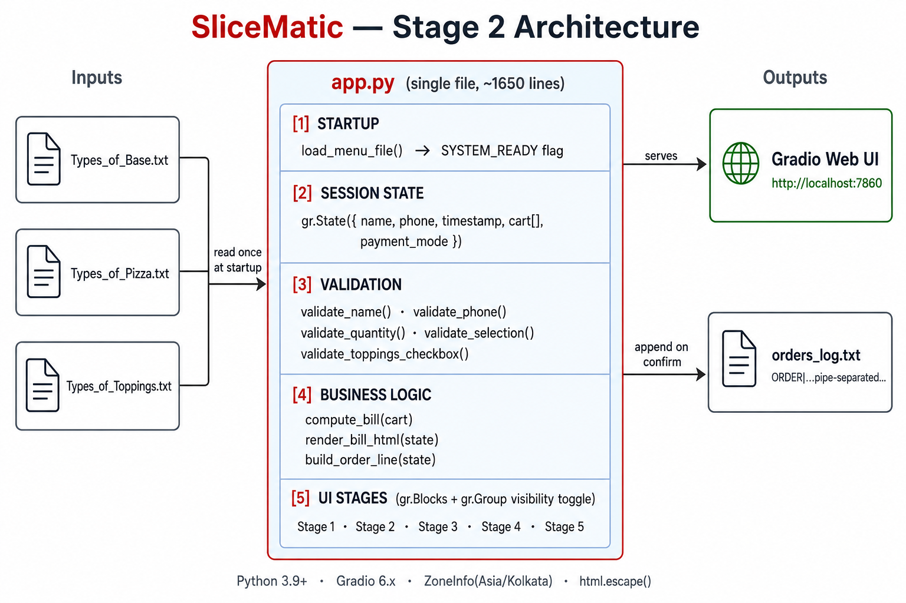
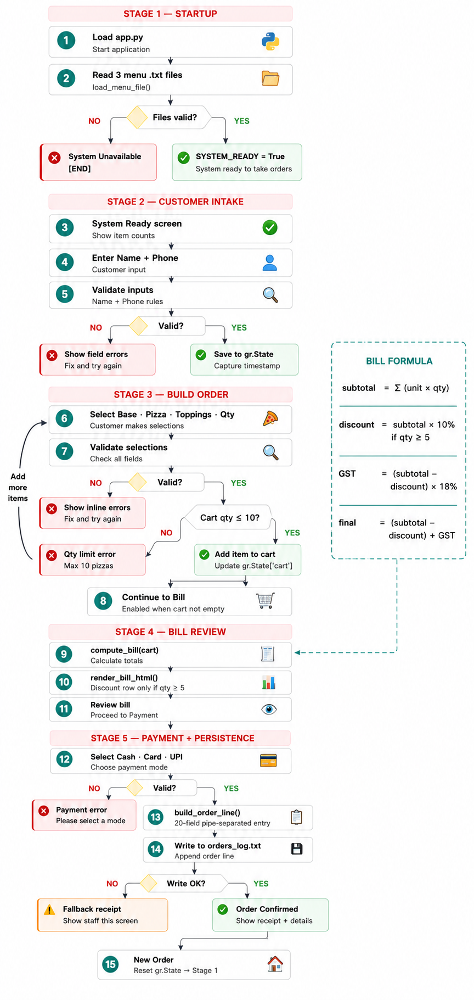

# SliceMatic — Pizza Ordering System

> FDE Academy Group 9 | Team Project | Single-outlet pizza delivery for SliceMatic, New Ashok Nagar, Delhi

---

## Project Overview

SliceMatic is a cart-based pizza ordering application built for a single-outlet delivery business. The project is delivered in stages — this README covers all three stages.

| Stage | Deliverable | Status |
|-------|-------------|--------|
| 1 — PRD + Business Economics | PDF document | Done |
| 2 — Gradio MVP 2 | Python app + menu files + order log + tests | Done |
| 3 — FullStack Next.js App | Next.js 14 + Supabase + Payment Gateways + AI | Done |

---

## Stage 2 Architecture (GRADIO-MVP-2)



### Data Flow



### Key Design Decisions

| Decision | Rationale |
|----------|-----------|
| `float` with no mid-calc rounding | Avoid floating-point money errors; rounding only at display/log |
| Named constants (`GST_RATE`, `DISCOUNT_RATE`, etc.) | No magic numbers; easy to audit |
| Menu loaded from `.txt` at runtime | Grader swaps files before testing — defensive parsing required |
| Cart-based multi-item ordering | Supports realistic orders; discount triggers on total qty across cart |
| GST calculated AFTER discount | `gst = (subtotal - discount) * 0.18` — matches PRD spec |
| Validation rejects without exception | All 11 edge cases return user-friendly error, never crash |

---

## Repository Structure

```
Slicematic/
├── README.md                          ← you are here
├── Project_Requirements/
│   ├── PizzaFlow_Assignment_Brief_FDE.pdf
│   ├── SliceMatic_Business_Economics.pdf
│   └── Types_of_*.txt                 (reference menus)
├── documents/
│   ├── SliceMatic_PRD_Business_Economics.pdf   (Stage 1 deliverable)
│   ├── razorpay_integration_analysis.md
│   ├── option_a_recommendation_engine_analysis.md
│   └── Our Team.xlsx
├── GRADIO-MVP-2/                      (Stage 2 deliverable)
│   ├── app.py                         (main application ~1650 lines)
│   ├── Types_of_Base.txt              (5 items)
│   ├── Types_of_Pizza.txt             (8 items)
│   ├── Types_of_Toppings.txt          (16 items)
│   ├── requirements.txt               (gradio>=6.0,<7)
│   ├── orders_log.txt                 (created/appended at runtime)
│   ├── test_core.py                   (file loading, validation, bill math, log format)
│   ├── test_edge_cases.py             (~72 edge cases with exact error-message checks)
│   ├── SPRINT_PLAN.md                 (6-sprint build plan + iteration checklists)
│   ├── assets/
│   │   └── menu/                      (pizza images served by Gradio)
│   └── changelog/
│       └── CHANGELOG.md               (v1.0.0 — 2026-06-27)
├── FullStack/                         (Stage 3 — Next.js full-stack app)
│   ├── app/                           (Next.js App Router pages + API routes)
│   │   └── api/
│   │       ├── menu/                  (GET — load menu)
│   │       ├── orders/                (POST — save order for Cash)
│   │       ├── recommend/             (POST — AI recommendation)
│   │       ├── payments/
│   │       │   ├── create-order/      (POST — Razorpay order for Card)
│   │       │   ├── verify/            (POST — Razorpay signature verify)
│   │       │   └── cashfree/
│   │       │       ├── create-order/  (POST — Cashfree order for UPI)
│   │       │       └── verify/        (POST — Cashfree payment verify)
│   │       ├── admin/                 (orders, menu, CSV export)
│   │       └── ai/                    (cart-insight, menu-copy, ops-briefing)
│   ├── components/
│   │   └── SliceMaticStage3.tsx       (main app component)
│   ├── lib/
│   │   ├── pricing.ts                (validation + bill math)
│   │   ├── data-service.ts           (Supabase / demo persistence)
│   │   ├── razorpay.ts               (Razorpay server helpers)
│   │   ├── cashfree.ts               (Cashfree server helpers)
│   │   ├── types.ts                  (shared types)
│   │   ├── seed-data.ts              (demo data fallback)
│   │   └── supabase.ts               (Supabase client)
│   ├── types/
│   │   └── cashfree.d.ts             (Cashfree JS SDK type declarations)
│   ├── supabase/
│   │   └── schema.sql                (full DB schema)
│   ├── scripts/
│   │   └── forecast_model.py         (scikit-learn demand forecast)
│   ├── lib/razorpay.test.ts          (Vitest unit tests — 9/9 passing)
│   ├── .env.example
│   ├── STAGE3_BUILD_REPORT.md
│   └── package.json
├── db/                                (Stage 3 prep — schema drafted)
│   ├── master schema & data_entry.sql
│   ├── transactions.sql
│   ├── slicematic_full_seed_data.sql
│   └── supabase.md
└── docs/
    └── superpowers/                   (design specs + implementation plans)
```

---

## Running the MVP

```bash
cd GRADIO-MVP-2
pip install -r requirements.txt
python app.py
```

The app launches on `http://localhost:7860` by default.

---

## Running the FullStack App (Stage 3)

```bash
cd FullStack
npm install
npm run dev
```

The app launches on `http://localhost:3000`.

### Environment Variables

Copy `.env.example` to `.env` and fill in the credentials:

```bash
cp .env.example .env
```

| Variable | Purpose | Required |
|----------|---------|----------|
| `NEXT_PUBLIC_SUPABASE_URL` | Supabase project URL | For DB persistence |
| `NEXT_PUBLIC_SUPABASE_ANON_KEY` | Supabase anon key | For DB persistence |
| `SUPABASE_SERVICE_ROLE_KEY` | Supabase service role key | For admin APIs |
| `RAZORPAY_KEY_ID` | Razorpay test key ID (`rzp_test_*`) | For Card payments |
| `RAZORPAY_KEY_SECRET` | Razorpay test key secret (server-only) | For Card payments |
| `CASHFREE_APP_ID` | Cashfree sandbox app ID | For UPI payments |
| `CASHFREE_SECRET_KEY` | Cashfree sandbox secret key (server-only) | For UPI payments |
| `CASHFREE_ENV` | `sandbox` or `production` | For UPI payments |
| `OPENROUTER_API_KEY` | OpenRouter API key | For AI recommendations |

The app works without any keys (demo mode with seed data). Payment gateways require their respective keys.

### Tests

```bash
cd FullStack
npm test          # Vitest — 9/9 tests (razorpay.test.ts)
```

---

## Payment Integration (Stage 3)

Payment routing uses two gateways — Razorpay for Card and Cashfree for UPI:

| Payment Mode | Gateway | Flow | Test Credentials |
|---|---|---|---|
| Cash | None (direct save) | Click Place Order → order saved immediately | N/A |
| Card | Razorpay | JS modal on same page → HMAC signature verify → save | Card: `5500 6700 0000 1002`, any CVV, any future expiry |
| UPI | Cashfree | Full-page redirect to Cashfree → payment → redirect back → server verify → save | VPA: `testsuccess@gocash` |

### Architecture

```
Customer clicks "Place Order"
       │
       ├── Cash ────────────► POST /api/orders ──► saveOrder() ──► tracking
       │
       ├── Card ────────────► POST /api/payments/create-order
       │                         └── Razorpay Orders API
       │                      Razorpay checkout.js modal opens
       │                         └── success handler
       │                      POST /api/payments/verify
       │                         └── HMAC-SHA256 verify + saveOrder()
       │                      ──► tracking
       │
       └── UPI ─────────────► POST /api/payments/cashfree/create-order
                                 └── Cashfree Orders API (payment_methods: "upi")
                              cashfree.checkout() redirects to Cashfree
                                 └── user pays on Cashfree page
                              Cashfree redirects back with ?order_id=...
                              POST /api/payments/cashfree/verify
                                 └── Cashfree payment status API + saveOrder()
                              ──► tracking
```

### Security

- All gateway secrets are server-only — never sent to the browser or logged.
- Bill amount is recomputed server-side in both `create-order` and `verify` routes.
- Razorpay uses HMAC-SHA256 signature verification (`crypto.timingSafeEqual`).
- Cashfree uses server-side payment status check via GET API.
- Orders persist only after successful payment verification (Card/UPI) or immediately (Cash).
- Test mode only — `rzp_test_` keys and Cashfree sandbox. No real charges.

---

## Business Rules (Locked)

| Rule | Value |
|------|-------|
| GST rate | 18% (applied after discount) |
| Bulk discount | 10% when total qty ≥ 5 |
| Max quantity per order | 10 |
| Customer name | Alphabets + spaces, 2–40 chars |
| Phone | Exactly 10 digits, starts with 6/7/8/9 |
| Payment modes | Cash, Card, UPI |
| Menu format | `ID;Name;Price` per line in `.txt` |

---

## Stage 1 Summary

Delivered a Product Requirements Document covering:
- 21 functional requirements for the ordering flow
- Business economics: AOV Rs.850, contribution margin 69.3%, break-even 12 orders/day
- Complete pricing model with GST and discount rules
- Edge-case specifications (11 mandatory rejection scenarios)

---

## Stage 3 Summary (FullStack)

Full-stack Next.js 14 application with:

- **Customer app**: Step-gated ordering journey (intake → AI recommendation → menu → checkout → tracking)
- **Admin console**: Revenue analytics, order management, menu lifecycle studio, AI ops briefing, demand forecast
- **Payment integration**: Razorpay (Card) + Cashfree (UPI) + Cash — test mode, server-verified
- **AI features**: OpenRouter-powered recommendation engine, cart strategist, menu copywriter, ops briefing
- **ML forecast**: scikit-learn demand prediction by hour/day
- **Database**: Supabase PostgreSQL with full schema (menu, orders, customers, analytics)
- **Auth**: Admin + customer accounts via Supabase Auth, with guest checkout support

See `FullStack/STAGE3_BUILD_REPORT.md` for the complete build report.

---

## Team

See `documents/Our Team.xlsx` for roles and contributors.
